# 관계와 순서는 도식으로 보여줍니다

사업 구조, 산업 지도, 지배구조, 절차, 일정처럼 숫자보다 관계와 순서가 중요한 내용을 그리는 도식 16종입니다. 모두 Mermaid 원고로 그려 같은 모양을 다시 만들 수 있습니다.

- 상태: 검토 중
- 갱신: 2026-09-29
- 주소: https://bishop33.github.io/axp-document-design-site-public/docs/data/diagrams/

### 사업과 조직

#### 사업 구조도

이 회사는 누구에게서 사서, 누구에게 팔고, 돈은 어떻게 들어오나요?

- 쓰는 문서: 기업현황, 투자검토 IM
- 이럴 때: 기업을 처음 소개하는 쪽에서 거래 상대와 제품·현금의 방향을 한 장으로 보여줄 때.
- 다른 표현이 나을 때: 거래 상대가 여덟 이상이면 상위 분류로 묶고 세부는 표로 뺍니다.
- 규칙: 대상 기업 하나만 짙은 면으로 둡니다.
- 규칙: 제품·판매는 실선, 현금은 점선으로 방향을 나눕니다.
- 규칙: 선 이름표는 두세 글자 동사(납품, 결제, 정산)로 씁니다.
- 범례: 실선 제품·판매, 점선 현금

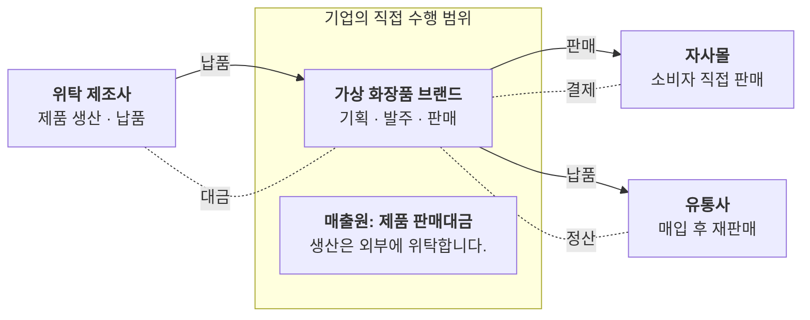

#### 매출 구성 트리

매출은 어떤 사업과 제품에서 나오나요?

- 쓰는 문서: 기업현황, 투자검토 IM, 산업분석
- 이럴 때: 매출을 사업부 → 제품군 순서로 나눠 규모와 비중을 함께 보여줄 때. 구성비 차트보다 계층이 잘 보입니다.
- 다른 표현이 나을 때: 계층이 셋을 넘거나 항목이 많으면 트리맵이나 표로 바꿉니다.
- 규칙: 상자마다 금액과 비중을 둘째 줄에 같은 형식으로 적습니다.
- 규칙: 같은 층의 합계가 위 상자의 값과 맞는지 확인합니다.
- 규칙: 가장 큰 가지만 짙게 하지 말고, 설명하려는 가지에만 강조를 둡니다.

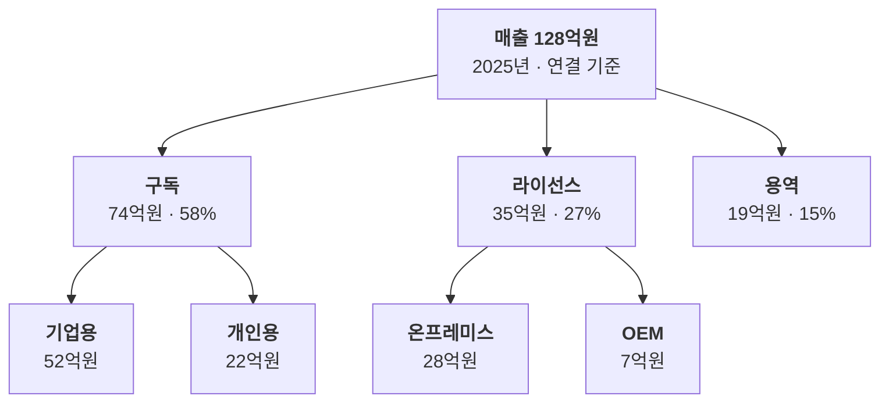

#### 조직도

조직은 어떻게 나뉘고 각 조직에 몇 명이 있나요?

- 쓰는 문서: 기업현황, 투자검토 IM, 기술제안서
- 이럴 때: 보고 체계와 조직 규모를 보여줄 때. 기술제안서에서는 수행 조직과 책임자를 보여줄 때 씁니다.
- 다른 표현이 나을 때: 사람 이름을 모두 넣지 않습니다. 둘째 층까지만 그리고 셋째 층은 인원만 적습니다.
- 규칙: 같은 층의 상자는 같은 높이에 둡니다.
- 규칙: 둘째 줄에는 인원 또는 책임자 한 가지만 적습니다.
- 규칙: 설명하려는 조직(예: 연구개발)에만 강조를 둡니다.

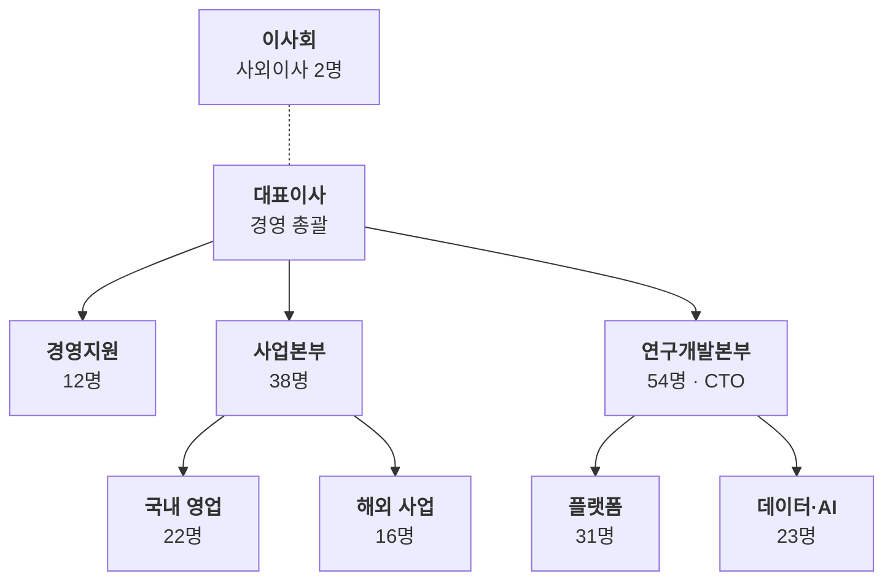

#### 지배구조·지분도

누가 이 회사를 소유하고, 이 회사는 어떤 회사를 소유하나요?

- 쓰는 문서: 기업현황, 투자검토 IM
- 이럴 때: 주주 구성과 자회사 관계를 지분율과 함께 보여줄 때. 위는 주주, 아래는 자회사로 방향을 고정합니다.
- 다른 표현이 나을 때: 주주가 많으면 5% 이상만 그리고 나머지는 ‘기타 주주’로 묶습니다.
- 규칙: 선 이름표에 지분율만 적습니다.
- 규칙: 지분율 기준일을 도식 아래 주석에 적습니다.
- 규칙: 합계가 100%인지 확인합니다.

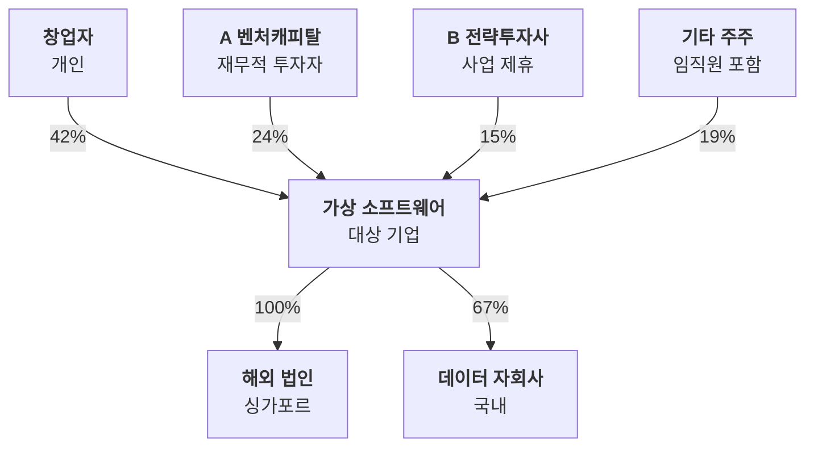

#### 투자 구조도

투자금은 어떤 경로로 들어가고, 거래 후 지분은 어떻게 바뀌나요?

- 쓰는 문서: 투자검토 IM
- 이럴 때: 투자 방식(신주·구주), 투자 기구, 거래 후 지분을 한 장으로 보여줄 때.
- 다른 표현이 나을 때: 조건이 많은 계약 내용(우선주 조건, 옵션)은 도식에 넣지 않고 표로 둡니다.
- 규칙: 자금 흐름은 점선, 지분 취득은 실선으로 나눕니다.
- 규칙: 금액과 지분율은 선 이름표가 아니라 상자 둘째 줄에 둡니다.
- 규칙: 거래 전·후 지분 비교는 도식 옆 표로 둡니다.
- 범례: 실선 지분, 점선 자금

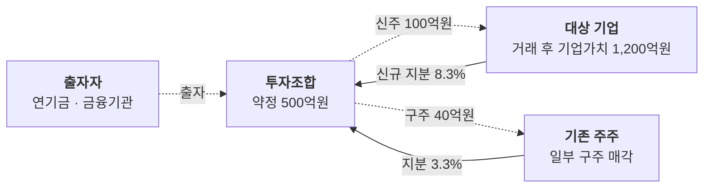

### 산업과 시장

#### 산업 지도(가치사슬)

이 산업은 어떤 단계로 이루어지고, 대상 기업은 어디에 있나요?

- 쓰는 문서: 기업현황, 산업분석, 투자검토 IM
- 이럴 때: 원료부터 소비자까지 단계를 왼쪽에서 오른쪽으로 놓고 대상 기업의 위치를 짚을 때.
- 다른 표현이 나을 때: 단계가 여섯을 넘으면 앞뒤 단계를 묶습니다. 기업 이름을 단계마다 많이 넣지 않습니다.
- 규칙: 단계 번호와 이름을 묶음 제목으로 둡니다.
- 규칙: 대상 기업이 있는 단계만 짙은 면으로 둡니다.
- 규칙: 단계를 돕는 지원 서비스는 도식 아래 한 줄 띠로 뺍니다.
- 도식 아래 띠: 지원 서비스 — 시험·분석, 패키지 디자인, 물류·보관

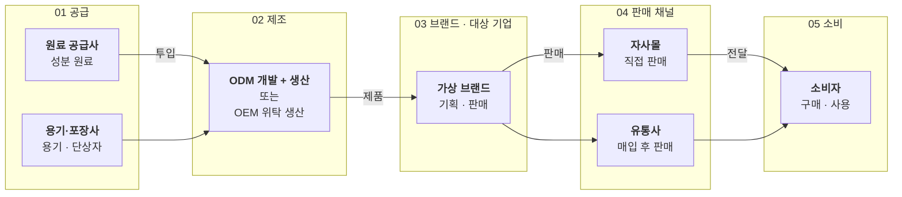

#### 플랫폼 생태계

플랫폼을 중심으로 누가 무엇을 주고받나요?

- 쓰는 문서: 기업현황, 산업분석, 투자검토 IM
- 이럴 때: 양면 시장(공급자·수요자)과 수수료 구조를 보여줄 때. 플랫폼을 가운데 두고 양쪽에 참여자를 놓습니다.
- 다른 표현이 나을 때: 참여자가 많아 선이 교차하면 공급 쪽과 수요 쪽을 나눠 두 장으로 그립니다.
- 규칙: 가운데 플랫폼만 짙게 둡니다.
- 규칙: 서비스 흐름은 실선, 수수료·대금은 점선으로 방향을 표시합니다.
- 규칙: 참여자 규모(가맹점 수, 이용자 수)를 둘째 줄에 적습니다.
- 범례: 실선 서비스, 점선 대금·수수료

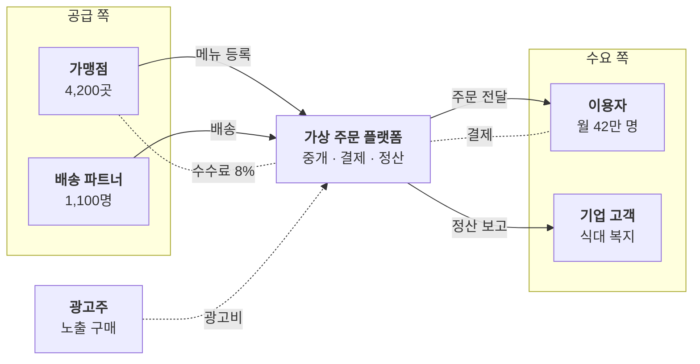

#### 시장 범위(TAM·SAM·SOM)

전체 시장 가운데 대상 기업이 실제로 공략하는 시장은 얼마인가요?

- 쓰는 문서: 산업분석, 투자검토 IM, 기업현황
- 이럴 때: 전체 시장에서 접근 가능한 시장, 확보 목표 시장으로 범위를 좁혀 가는 논리를 보여줄 때.
- 다른 표현이 나을 때: 각 층의 산정 근거(출처, 가정)를 밝힐 수 없으면 숫자를 넣지 않습니다.
- 규칙: 바깥에서 안쪽으로 좁아지는 순서를 지킵니다.
- 규칙: 각 층에 금액과 정의를 한 줄씩 적습니다.
- 규칙: 산정 방식(하향식·상향식)과 출처를 도식 아래에 적습니다.

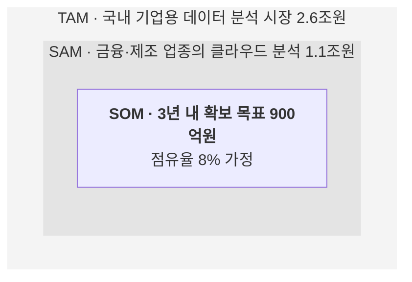

#### 포지셔닝 맵(2×2)

경쟁사와 비교해 대상 기업은 어떤 위치에 있나요?

- 쓰는 문서: 산업분석, 기업현황, 발표
- 이럴 때: 두 가지 기준으로 경쟁사를 배치해 차별점을 보여줄 때. 두 축은 서로 관계가 적은 기준을 고릅니다.
- 다른 표현이 나을 때: 축 기준을 수치로 정의할 수 없으면 주관적 배치임을 밝히거나 표로 비교합니다.
- 규칙: 축 양 끝에 기준의 낮음·높음을 적습니다.
- 규칙: 사분면 이름은 짧은 명사로 둡니다.
- 규칙: 대상 기업 점만 크고 짙게 둡니다.
- 규칙: 점 위치의 근거(점수, 설문)를 주석에 적습니다.

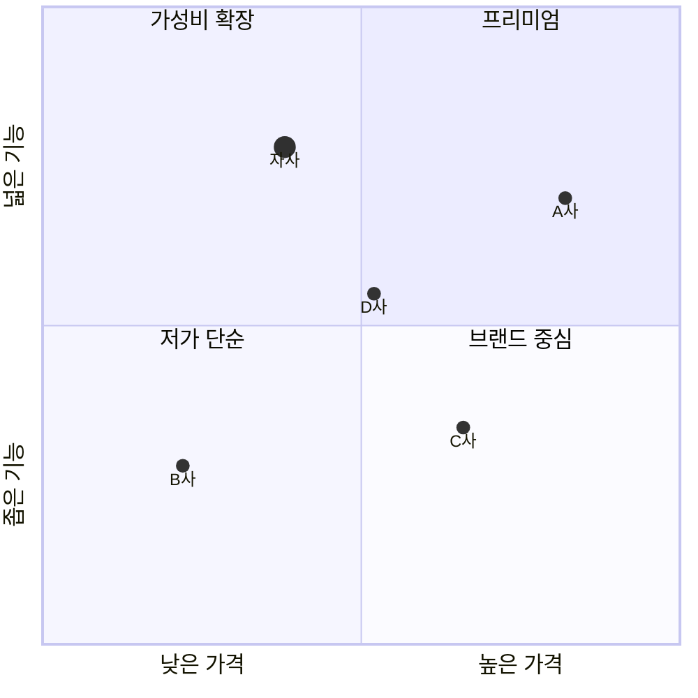

### 흐름과 절차

#### 공정·업무 단계

제품이나 업무는 어떤 순서로 만들어지나요?

- 쓰는 문서: 기업현황, 기술제안서, 산업분석
- 이럴 때: 분기 없이 차례로 이어지는 단계를 설명할 때. 단계마다 설비·산출물과 설명을 같은 형식으로 둡니다.
- 다른 표현이 나을 때: 조건에 따라 갈라지면 의사결정 흐름을 씁니다. 단계가 여섯을 넘으면 묶습니다.
- 규칙: 단계 번호를 이름 앞에 붙입니다.
- 규칙: 상자 안 줄 수와 순서(설비 → 설명)를 모든 단계에서 같게 둡니다.
- 규칙: 화살표에는 이름표를 붙이지 않습니다.

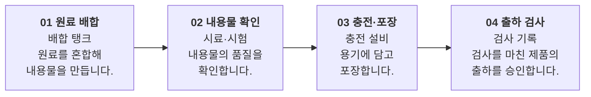

#### 의사결정 흐름

조건에 따라 업무가 어떻게 갈라지고 누가 처리하나요?

- 쓰는 문서: 기술제안서, 기업현황
- 이럴 때: 예·아니요 판단에 따라 경로가 갈라지는 업무를 설명할 때. 담당자는 각 단계 둘째 줄에 적습니다.
- 다른 표현이 나을 때: 판단이 셋 이상 이어지면 표(조건 × 처리)로 바꿉니다.
- 규칙: 판단은 마름모, 처리는 사각형으로 모양을 나눕니다.
- 규칙: 판단에서 나가는 선에 예·아니요를 적습니다.
- 규칙: 되돌아가는 선은 점선으로 둡니다.
- 범례: 실선 업무 흐름, 점선 되돌림

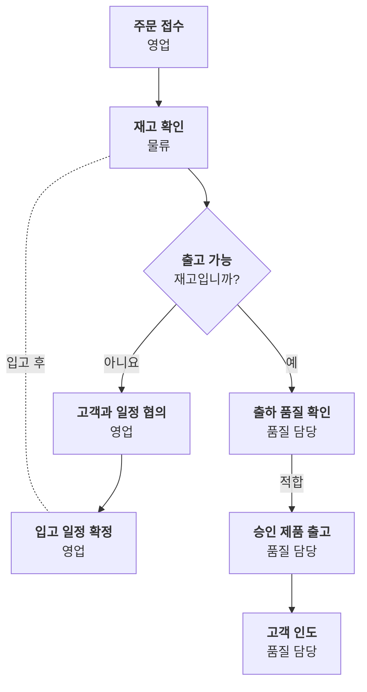

#### 시스템 구성도

제안하는 시스템은 어떤 층으로 이루어지고 무엇과 연결되나요?

- 쓰는 문서: 기술제안서
- 이럴 때: 사용자 → 서비스 → 데이터 → 외부 연계 순서로 층을 나눠 구성 요소를 보여줄 때.
- 다른 표현이 나을 때: 서버·네트워크 세부(포트, 사양)는 도식에 넣지 않고 별도 표로 둡니다.
- 규칙: 층은 묶음으로, 층 순서는 왼쪽(사용자)에서 오른쪽(외부)으로 둡니다.
- 규칙: 이번 제안의 신규 구축 범위만 짙게 둡니다.
- 규칙: 기존 시스템은 옅은 면으로 구분합니다.

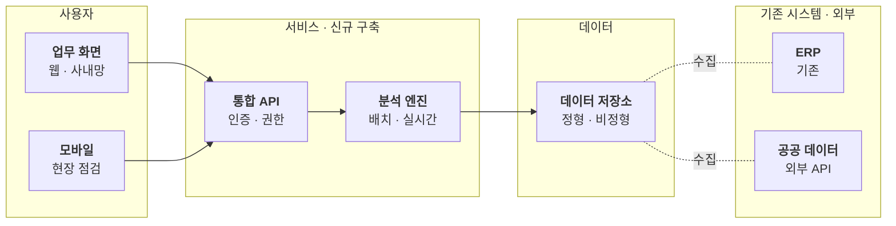

#### 현행·개선 비교(AS-IS/TO-BE)

지금 방식과 바뀐 방식은 무엇이 다른가요?

- 쓰는 문서: 기술제안서, 발표
- 이럴 때: 업무나 시스템이 바뀌는 전후를 같은 단계 순서로 나란히 보여줄 때.
- 다른 표현이 나을 때: 바뀌지 않는 단계까지 모두 그리지 않습니다. 달라지는 단계만 남깁니다.
- 규칙: 왼쪽은 현행, 오른쪽은 개선으로 순서를 고정합니다.
- 규칙: 같은 단계는 같은 높이에 둡니다.
- 규칙: 개선되는 단계만 짙게 두고 효과(시간, 비용)를 둘째 줄에 적습니다.

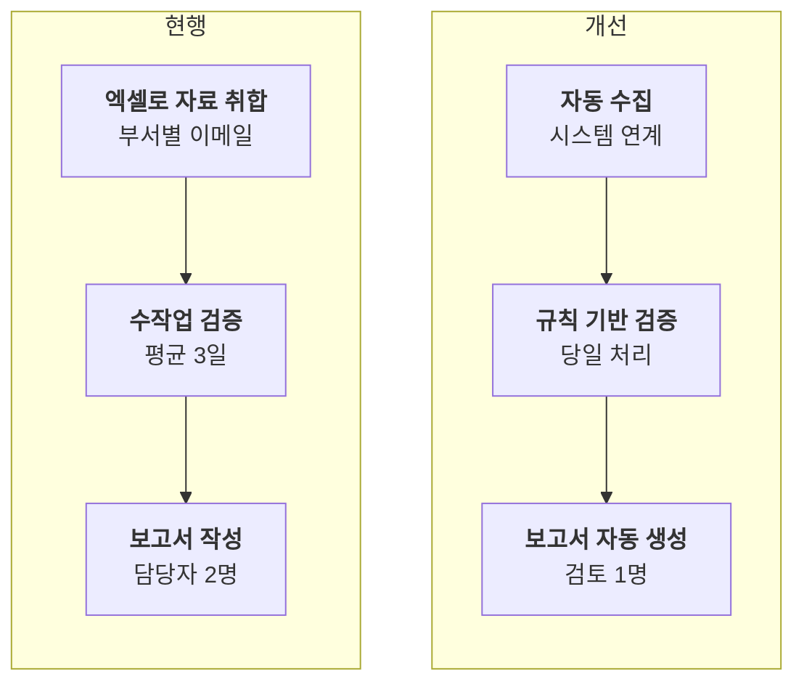

### 시간과 일정

#### 연혁

회사는 언제 어떤 일을 거쳐 지금에 이르렀나요?

- 쓰는 문서: 기업현황, 투자검토 IM, 발표
- 이럴 때: 설립부터 현재까지 주요 사건을 시간 순서로 보여줄 때. 사건은 연도마다 두 개 이하로 줄입니다.
- 다른 표현이 나을 때: 사건이 열 개를 넘으면 표(연도 · 내용)로 바꿉니다. 간격이 불규칙해도 같은 폭으로 그린다는 점을 기억합니다.
- 규칙: 연도는 굵게, 사건은 둘째 줄에 적습니다.
- 규칙: 현재 또는 설명하려는 시점만 짙게 둡니다.
- 규칙: 투자·매출 같은 수치 사건은 금액을 함께 적습니다.

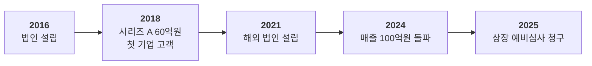

#### 추진 일정(간트)

사업은 어떤 단계로, 언제부터 언제까지 진행하나요?

- 쓰는 문서: 기술제안서, 투자검토 IM
- 이럴 때: 단계별 작업의 기간과 겹침을 보여줄 때. 기술제안서의 수행 일정에 씁니다.
- 다른 표현이 나을 때: 작업이 열다섯을 넘으면 단계 단위로 묶고 세부 일정은 부록 표로 둡니다.
- 규칙: 단계(묶음)와 작업의 두 층만 둡니다.
- 규칙: 핵심 작업 또는 검수 시점만 짙게 둡니다.
- 규칙: 기간 단위(월·주)를 축에 적습니다.

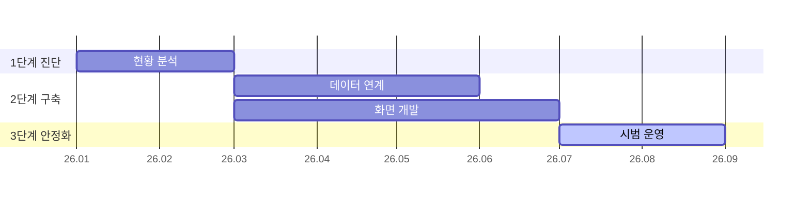

### 논리와 판단

#### 이슈 트리

결과(문제)는 어떤 원인으로 나눠 설명할 수 있나요?

- 쓰는 문서: 투자검토 IM, 산업분석, 기업현황
- 이럴 때: 하나의 결과를 겹치지 않는 원인으로 나누고(MECE), 확인된 원인을 짚을 때.
- 다른 표현이 나을 때: 가지가 넷을 넘거나 층이 셋을 넘으면 표로 바꿉니다.
- 규칙: 왼쪽에 결과, 오른쪽으로 갈수록 세부 원인을 둡니다.
- 규칙: 같은 층의 가지는 서로 겹치지 않게 나눕니다.
- 규칙: 데이터로 확인된 원인만 짙게 두고 수치를 적습니다.

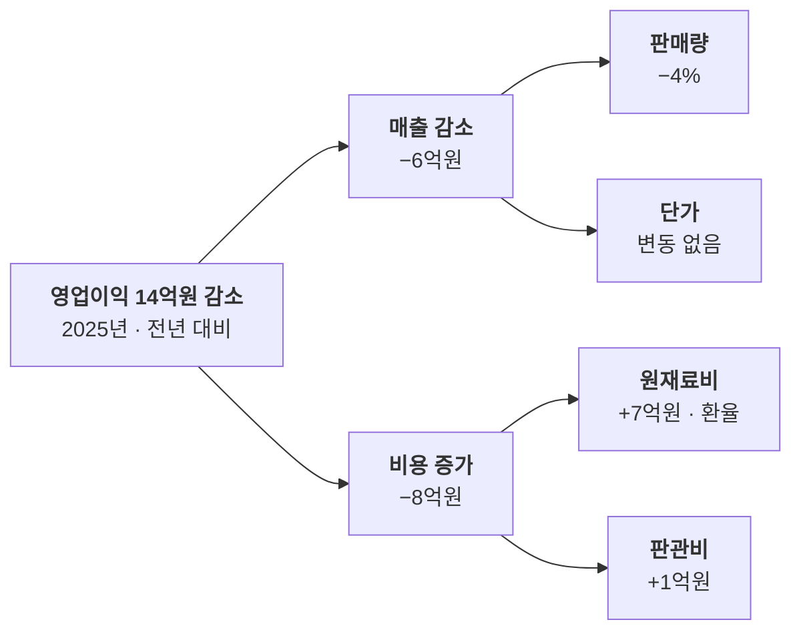

공통 설정은 [diagram-theme.js](https://bishop33.github.io/axp-document-design-site-public/guide/diagram-theme.js)에 있다. Mermaid 12.0.0, dagre 배치, classDef focus·soft·note.

## 모든 도식에 공통으로 지키는 것

- 강조는 한 곳만 둡니다. 대상 기업, 결론, 이번 제안의 범위 가운데 하나입니다.
- 선의 뜻을 고정합니다. 실선은 제품·판매·업무의 흐름, 점선은 현금·되돌림입니다.
- 상자 안은 두 줄입니다. 첫 줄은 이름(굵게), 둘째 줄은 규모나 역할입니다.
- 도식 아래에는 기준일, 출처, 가정을 적습니다.
- 모든 도식은 공통 설정으로 그립니다. 모양을 바꾸려면 개별 도식이 아니라 공통 설정을 고칩니다.

예시는 모두 가상 기업과 가상 수치입니다. Markdown으로 보기에서는 각 도식의 Mermaid 원고를 그대로 복사할 수 있습니다.
