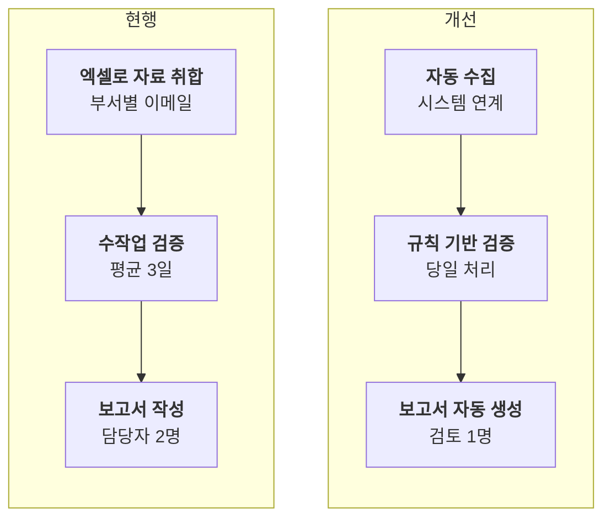

# 현행·개선 비교(AS-IS/TO-BE)

지금 방식과 바뀐 방식은 무엇이 다른가요?

- 분류: 흐름과 절차
- 쓰는 문서: 기술제안서, 발표
- 주소: https://bishop33.github.io/axp-document-design-site-public/docs/diagrams/as-is-to-be/

## 이럴 때 사용합니다

업무나 시스템이 바뀌는 전후를 같은 단계 순서로 나란히 보여줄 때.

## 다른 표현이 나을 때

바뀌지 않는 단계까지 모두 그리지 않습니다. 달라지는 단계만 남깁니다.

## 표현할 때 지킬 기준

- 왼쪽은 현행, 오른쪽은 개선으로 순서를 고정합니다.
- 같은 단계는 같은 높이에 둡니다.
- 개선되는 단계만 짙게 두고 효과(시간, 비용)를 둘째 줄에 적습니다.

## Mermaid 원고

공통 설정 [diagram-theme.js](https://bishop33.github.io/axp-document-design-site-public/guide/diagram-theme.js)로 그린다(Mermaid 12.0.0, dagre 배치, classDef focus·soft·note). 예시는 가상 기업·가상 수치다.

