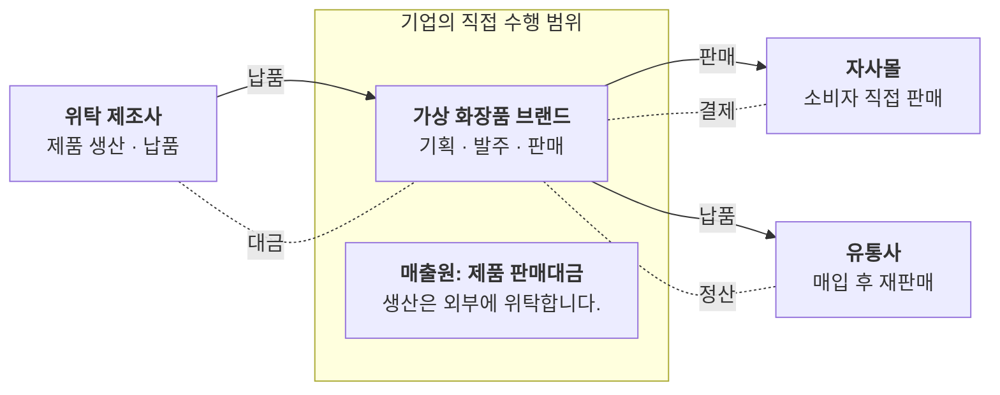

# 사업 구조도

이 회사는 누구에게서 사서, 누구에게 팔고, 돈은 어떻게 들어오나요?

- 분류: 사업과 조직
- 쓰는 문서: 기업현황, 투자검토 IM
- 주소: https://bishop33.github.io/axp-document-design-site-public/docs/diagrams/business-model/

## 이럴 때 사용합니다

기업을 처음 소개하는 쪽에서 거래 상대와 제품·현금의 방향을 한 장으로 보여줄 때.

## 다른 표현이 나을 때

거래 상대가 여덟 이상이면 상위 분류로 묶고 세부는 표로 뺍니다.

## 표현할 때 지킬 기준

- 대상 기업 하나만 짙은 면으로 둡니다.
- 제품·판매는 실선, 현금은 점선으로 방향을 나눕니다.
- 선 이름표는 두세 글자 동사(납품, 결제, 정산)로 씁니다.
- 범례: 실선 제품·판매, 점선 현금

## Mermaid 원고

공통 설정 [diagram-theme.js](https://bishop33.github.io/axp-document-design-site-public/guide/diagram-theme.js)로 그린다(Mermaid 12.0.0, dagre 배치, classDef focus·soft·note). 예시는 가상 기업·가상 수치다.

