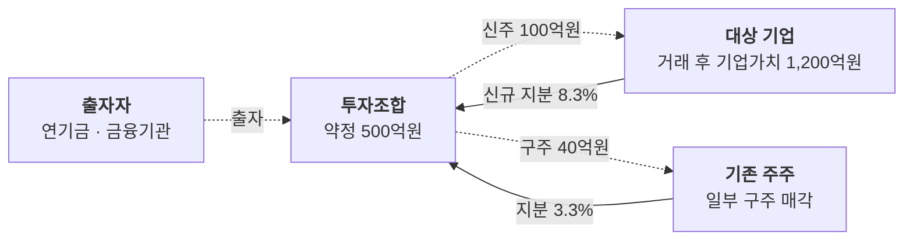

# 투자 구조도

투자금은 어떤 경로로 들어가고, 거래 후 지분은 어떻게 바뀌나요?

- 분류: 관계와 구조
- 쓰는 문서: 투자검토 IM
- 주소: https://bishop33.github.io/axp-document-design-site-public/docs/diagrams/deal-structure/

## 이럴 때 사용합니다

투자 방식(신주·구주), 투자 기구, 거래 후 지분을 한 장으로 보여줄 때.

## 다른 표현이 나을 때

조건이 많은 계약 내용(우선주 조건, 옵션)은 도식에 넣지 않고 표로 둡니다.

## 표현할 때 지킬 기준

- 자금 흐름은 점선, 지분 취득은 실선으로 나눕니다.
- 금액과 지분율은 선 이름표가 아니라 상자 둘째 줄에 둡니다.
- 거래 전·후 지분 비교는 도식 옆 표로 둡니다.
- 범례: 실선 지분, 점선 자금

## Mermaid 원고

공통 설정 [diagram-theme.js](https://bishop33.github.io/axp-document-design-site-public/guide/diagram-theme.js)로 그린다(Mermaid 12.0.0, dagre 배치, classDef focus·soft·note). 예시는 가상 기업·가상 수치다.

