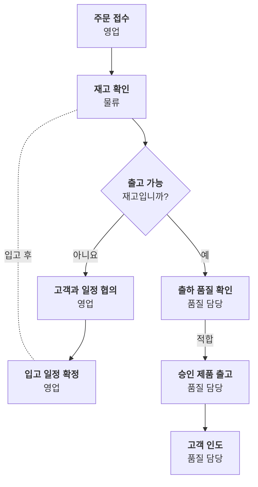

# 의사결정 흐름

조건에 따라 업무가 어떻게 갈라지고 누가 처리하나요?

- 분류: 흐름과 절차
- 쓰는 문서: 기술제안서, 기업현황
- 주소: https://bishop33.github.io/axp-document-design-site-public/docs/diagrams/decision-flow/

## 이럴 때 사용합니다

예·아니요 판단에 따라 경로가 갈라지는 업무를 설명할 때. 담당자는 각 단계 둘째 줄에 적습니다.

## 다른 표현이 나을 때

판단이 셋 이상 이어지면 표(조건 × 처리)로 바꿉니다.

## 표현할 때 지킬 기준

- 판단은 마름모, 처리는 사각형으로 모양을 나눕니다.
- 판단에서 나가는 선에 예·아니요를 적습니다.
- 되돌아가는 선은 점선으로 둡니다.
- 범례: 실선 업무 흐름, 점선 되돌림

## Mermaid 원고

공통 설정 [diagram-theme.js](https://bishop33.github.io/axp-document-design-site-public/guide/diagram-theme.js)로 그린다(Mermaid 12.0.0, dagre 배치, classDef focus·soft·note). 예시는 가상 기업·가상 수치다.

