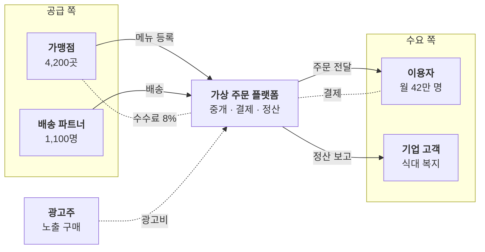

# 플랫폼 생태계

플랫폼을 중심으로 누가 무엇을 주고받나요?

- 분류: 산업과 시장
- 쓰는 문서: 기업현황, 산업분석, 투자검토 IM
- 주소: https://bishop33.github.io/axp-document-design-site-public/docs/diagrams/ecosystem/

## 이럴 때 사용합니다

양면 시장(공급자·수요자)과 수수료 구조를 보여줄 때. 플랫폼을 가운데 두고 양쪽에 참여자를 놓습니다.

## 다른 표현이 나을 때

참여자가 많아 선이 교차하면 공급 쪽과 수요 쪽을 나눠 두 장으로 그립니다.

## 표현할 때 지킬 기준

- 가운데 플랫폼만 짙게 둡니다.
- 서비스 흐름은 실선, 수수료·대금은 점선으로 방향을 표시합니다.
- 참여자 규모(가맹점 수, 이용자 수)를 둘째 줄에 적습니다.
- 범례: 실선 서비스, 점선 대금·수수료

## Mermaid 원고

공통 설정 [diagram-theme.js](https://bishop33.github.io/axp-document-design-site-public/guide/diagram-theme.js)로 그린다(Mermaid 12.0.0, dagre 배치, classDef focus·soft·note). 예시는 가상 기업·가상 수치다.

