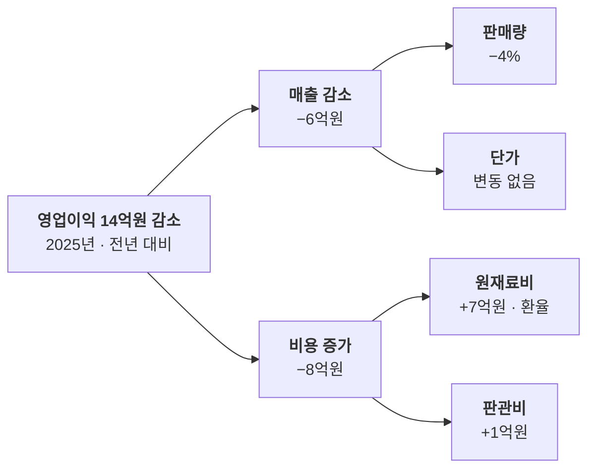

# 이슈 트리

결과(문제)는 어떤 원인으로 나눠 설명할 수 있나요?

- 분류: 논리와 판단
- 쓰는 문서: 투자검토 IM, 산업분석, 기업현황
- 주소: https://bishop33.github.io/axp-document-design-site-public/docs/diagrams/issue-tree/

## 이럴 때 사용합니다

하나의 결과를 겹치지 않는 원인으로 나누고(MECE), 확인된 원인을 짚을 때.

## 다른 표현이 나을 때

가지가 넷을 넘거나 층이 셋을 넘으면 표로 바꿉니다.

## 표현할 때 지킬 기준

- 왼쪽에 결과, 오른쪽으로 갈수록 세부 원인을 둡니다.
- 같은 층의 가지는 서로 겹치지 않게 나눕니다.
- 데이터로 확인된 원인만 짙게 두고 수치를 적습니다.

## Mermaid 원고

공통 설정 [diagram-theme.js](https://bishop33.github.io/axp-document-design-site-public/guide/diagram-theme.js)로 그린다(Mermaid 12.0.0, dagre 배치, classDef focus·soft·note). 예시는 가상 기업·가상 수치다.

