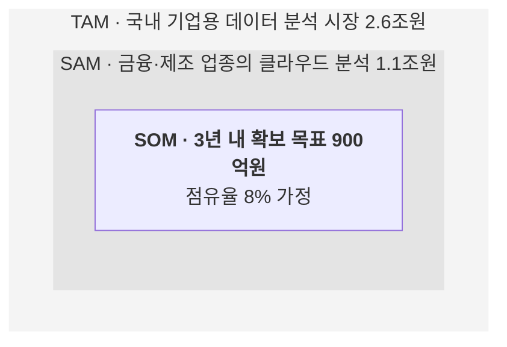

# 시장 범위(TAM·SAM·SOM)

전체 시장 가운데 대상 기업이 실제로 공략하는 시장은 얼마인가요?

- 분류: 시장 속 위치
- 쓰는 문서: 산업분석, 투자검토 IM, 기업현황
- 주소: https://bishop33.github.io/axp-document-design-site-public/docs/diagrams/market-sizing/

## 이럴 때 사용합니다

전체 시장에서 접근 가능한 시장, 확보 목표 시장으로 범위를 좁혀 가는 논리를 보여줄 때.

## 다른 표현이 나을 때

각 층의 산정 근거(출처, 가정)를 밝힐 수 없으면 숫자를 넣지 않습니다.

## 표현할 때 지킬 기준

- 바깥에서 안쪽으로 좁아지는 순서를 지킵니다.
- 각 층에 금액과 정의를 한 줄씩 적습니다.
- 산정 방식(하향식·상향식)과 출처를 도식 아래에 적습니다.

## Mermaid 원고

공통 설정 [diagram-theme.js](https://bishop33.github.io/axp-document-design-site-public/guide/diagram-theme.js)로 그린다(Mermaid 12.0.0, dagre 배치, classDef focus·soft·note). 예시는 가상 기업·가상 수치다.

