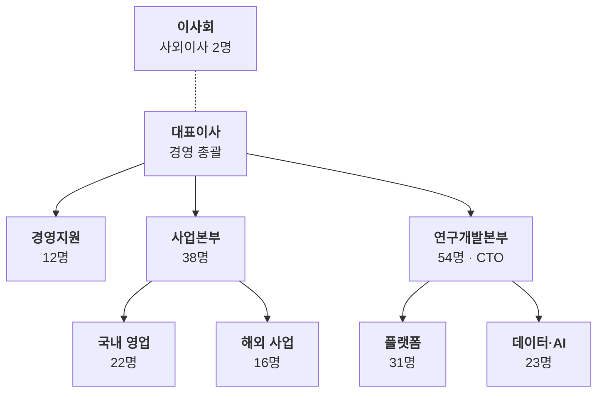

# 조직도

조직은 어떻게 나뉘고 각 조직에 몇 명이 있나요?

- 분류: 사업과 조직
- 쓰는 문서: 기업현황, 투자검토 IM, 기술제안서
- 주소: https://bishop33.github.io/axp-document-design-site-public/docs/diagrams/org-chart/

## 이럴 때 사용합니다

보고 체계와 조직 규모를 보여줄 때. 기술제안서에서는 수행 조직과 책임자를 보여줄 때 씁니다.

## 다른 표현이 나을 때

사람 이름을 모두 넣지 않습니다. 둘째 층까지만 그리고 셋째 층은 인원만 적습니다.

## 표현할 때 지킬 기준

- 같은 층의 상자는 같은 높이에 둡니다.
- 둘째 줄에는 인원 또는 책임자 한 가지만 적습니다.
- 설명하려는 조직(예: 연구개발)에만 강조를 둡니다.

## Mermaid 원고

공통 설정 [diagram-theme.js](https://bishop33.github.io/axp-document-design-site-public/guide/diagram-theme.js)로 그린다(Mermaid 12.0.0, dagre 배치, classDef focus·soft·note). 예시는 가상 기업·가상 수치다.

