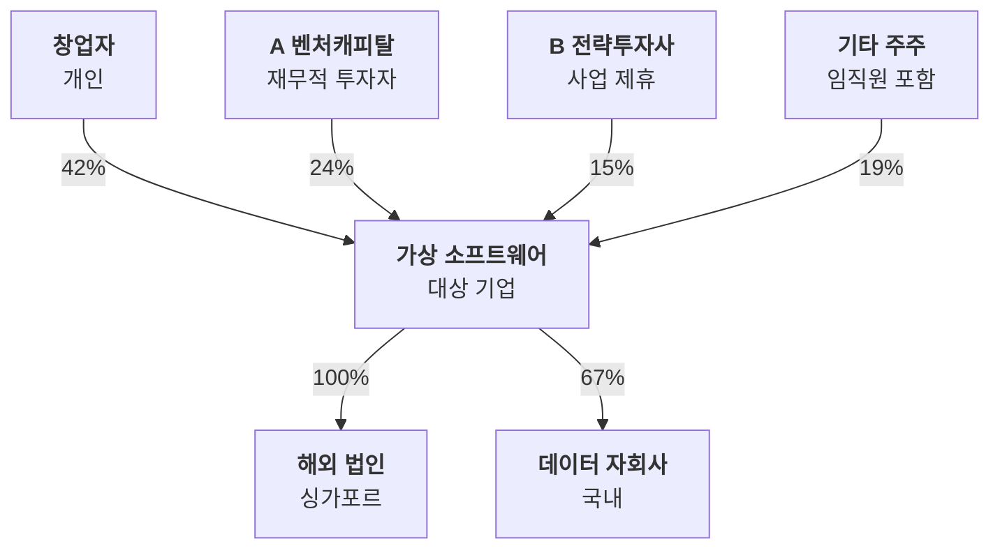

# 지배구조·지분도

누가 이 회사를 소유하고, 이 회사는 어떤 회사를 소유하나요?

- 분류: 관계와 구조
- 쓰는 문서: 기업현황, 투자검토 IM
- 주소: https://bishop33.github.io/axp-document-design-site-public/docs/diagrams/ownership/

## 이럴 때 사용합니다

주주 구성과 자회사 관계를 지분율과 함께 보여줄 때. 위는 주주, 아래는 자회사로 방향을 고정합니다.

## 다른 표현이 나을 때

주주가 많으면 5% 이상만 그리고 나머지는 ‘기타 주주’로 묶습니다.

## 표현할 때 지킬 기준

- 선 이름표에 지분율만 적습니다.
- 지분율 기준일을 도식 아래 주석에 적습니다.
- 합계가 100%인지 확인합니다.

## Mermaid 원고

공통 설정 [diagram-theme.js](https://bishop33.github.io/axp-document-design-site-public/guide/diagram-theme.js)로 그린다(Mermaid 12.0.0, dagre 배치, classDef focus·soft·note). 예시는 가상 기업·가상 수치다.

