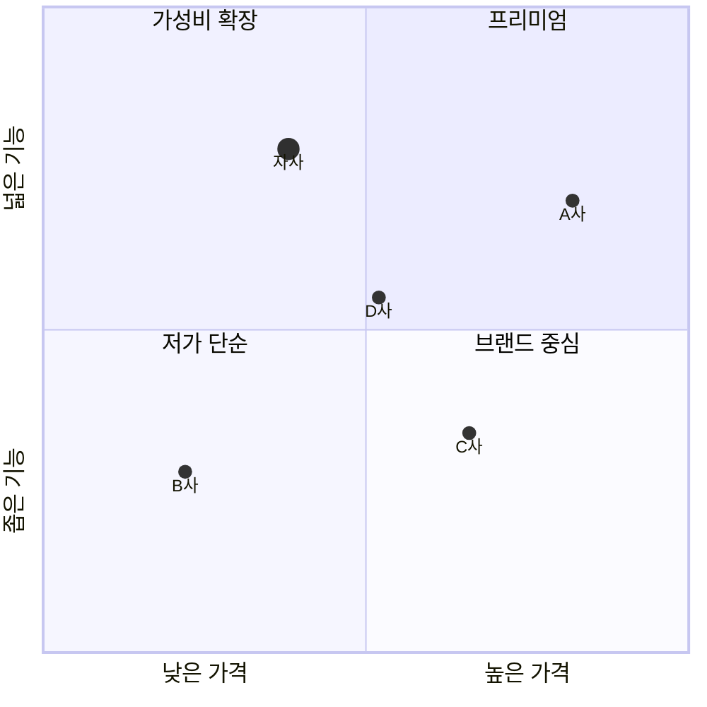

# 포지셔닝 맵(2×2)

경쟁사와 비교해 대상 기업은 어떤 위치에 있나요?

- 분류: 시장 속 위치
- 쓰는 문서: 산업분석, 기업현황, 발표
- 주소: https://bishop33.github.io/axp-document-design-site-public/docs/diagrams/positioning/

## 이럴 때 사용합니다

두 가지 기준으로 경쟁사를 배치해 차별점을 보여줄 때. 두 축은 서로 관계가 적은 기준을 고릅니다.

## 다른 표현이 나을 때

축 기준을 수치로 정의할 수 없으면 주관적 배치임을 밝히거나 표로 비교합니다.

## 표현할 때 지킬 기준

- 축 양 끝에 기준의 낮음·높음을 적습니다.
- 사분면 이름은 짧은 명사로 둡니다.
- 대상 기업 점만 크고 짙게 둡니다.
- 점 위치의 근거(점수, 설문)를 주석에 적습니다.

## Mermaid 원고

공통 설정 [diagram-theme.js](https://bishop33.github.io/axp-document-design-site-public/guide/diagram-theme.js)로 그린다(Mermaid 12.0.0, dagre 배치, classDef focus·soft·note). 예시는 가상 기업·가상 수치다.

