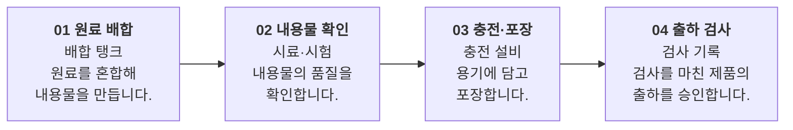

# 공정·업무 단계

제품이나 업무는 어떤 순서로 만들어지나요?

- 분류: 흐름과 절차
- 쓰는 문서: 기업현황, 기술제안서, 산업분석
- 주소: https://bishop33.github.io/axp-document-design-site-public/docs/diagrams/process/

## 이럴 때 사용합니다

분기 없이 차례로 이어지는 단계를 설명할 때. 단계마다 설비·산출물과 설명을 같은 형식으로 둡니다.

## 다른 표현이 나을 때

조건에 따라 갈라지면 의사결정 흐름을 씁니다. 단계가 여섯을 넘으면 묶습니다.

## 표현할 때 지킬 기준

- 단계 번호를 이름 앞에 붙입니다.
- 상자 안 줄 수와 순서(설비 → 설명)를 모든 단계에서 같게 둡니다.
- 화살표에는 이름표를 붙이지 않습니다.

## Mermaid 원고

공통 설정 [diagram-theme.js](https://bishop33.github.io/axp-document-design-site-public/guide/diagram-theme.js)로 그린다(Mermaid 12.0.0, dagre 배치, classDef focus·soft·note). 예시는 가상 기업·가상 수치다.

