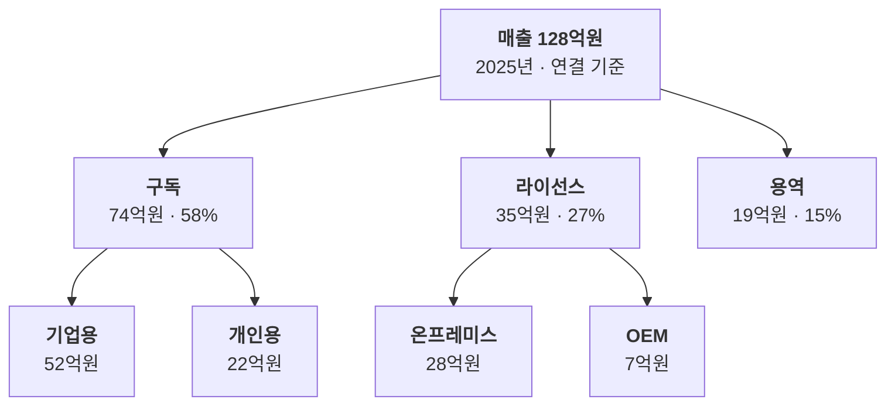

# 매출 구성 트리

매출은 어떤 사업과 제품에서 나오나요?

- 분류: 사업과 조직
- 쓰는 문서: 기업현황, 투자검토 IM, 산업분석
- 주소: https://bishop33.github.io/axp-document-design-site-public/docs/diagrams/revenue-tree/

## 이럴 때 사용합니다

매출을 사업부 → 제품군 순서로 나눠 규모와 비중을 함께 보여줄 때. 구성비 차트보다 계층이 잘 보입니다.

## 다른 표현이 나을 때

계층이 셋을 넘거나 항목이 많으면 트리맵이나 표로 바꿉니다.

## 표현할 때 지킬 기준

- 상자마다 금액과 비중을 둘째 줄에 같은 형식으로 적습니다.
- 같은 층의 합계가 위 상자의 값과 맞는지 확인합니다.
- 가장 큰 가지만 짙게 하지 말고, 설명하려는 가지에만 강조를 둡니다.

## Mermaid 원고

공통 설정 [diagram-theme.js](https://bishop33.github.io/axp-document-design-site-public/guide/diagram-theme.js)로 그린다(Mermaid 12.0.0, dagre 배치, classDef focus·soft·note). 예시는 가상 기업·가상 수치다.

