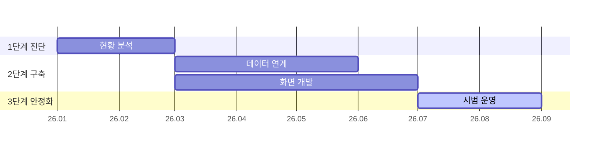

# 추진 일정(간트)

사업은 어떤 단계로, 언제부터 언제까지 진행하나요?

- 분류: 시간과 일정
- 쓰는 문서: 기술제안서, 투자검토 IM
- 주소: https://bishop33.github.io/axp-document-design-site-public/docs/diagrams/roadmap/

## 이럴 때 사용합니다

단계별 작업의 기간과 겹침을 보여줄 때. 기술제안서의 수행 일정에 씁니다.

## 다른 표현이 나을 때

작업이 열다섯을 넘으면 단계 단위로 묶고 세부 일정은 부록 표로 둡니다.

## 표현할 때 지킬 기준

- 단계(묶음)와 작업의 두 층만 둡니다.
- 핵심 작업 또는 검수 시점만 짙게 둡니다.
- 기간 단위(월·주)를 축에 적습니다.

## Mermaid 원고

공통 설정 [diagram-theme.js](https://bishop33.github.io/axp-document-design-site-public/guide/diagram-theme.js)로 그린다(Mermaid 12.0.0, dagre 배치, classDef focus·soft·note). 예시는 가상 기업·가상 수치다.

