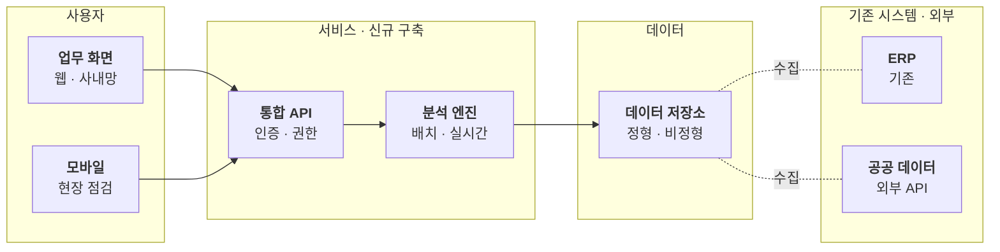

# 시스템 구성도

제안하는 시스템은 어떤 층으로 이루어지고 무엇과 연결되나요?

- 분류: 흐름과 절차
- 쓰는 문서: 기술제안서
- 주소: https://bishop33.github.io/axp-document-design-site-public/docs/diagrams/system-architecture/

## 이럴 때 사용합니다

사용자 → 서비스 → 데이터 → 외부 연계 순서로 층을 나눠 구성 요소를 보여줄 때.

## 다른 표현이 나을 때

서버·네트워크 세부(포트, 사양)는 도식에 넣지 않고 별도 표로 둡니다.

## 표현할 때 지킬 기준

- 층은 묶음으로, 층 순서는 왼쪽(사용자)에서 오른쪽(외부)으로 둡니다.
- 이번 제안의 신규 구축 범위만 짙게 둡니다.
- 기존 시스템은 옅은 면으로 구분합니다.

## Mermaid 원고

공통 설정 [diagram-theme.js](https://bishop33.github.io/axp-document-design-site-public/guide/diagram-theme.js)로 그린다(Mermaid 12.0.0, dagre 배치, classDef focus·soft·note). 예시는 가상 기업·가상 수치다.

