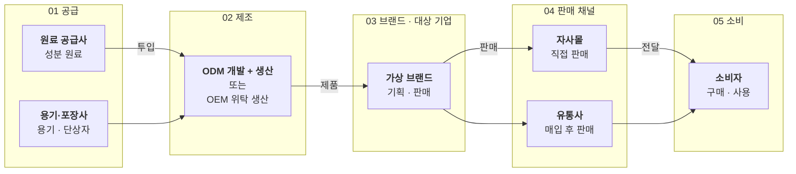

# 산업 지도(가치사슬)

이 산업은 어떤 단계로 이루어지고, 대상 기업은 어디에 있나요?

- 분류: 산업과 시장
- 쓰는 문서: 기업현황, 산업분석, 투자검토 IM
- 주소: https://bishop33.github.io/axp-document-design-site-public/docs/diagrams/value-chain/

## 이럴 때 사용합니다

원료부터 소비자까지 단계를 왼쪽에서 오른쪽으로 놓고 대상 기업의 위치를 짚을 때.

## 다른 표현이 나을 때

단계가 여섯을 넘으면 앞뒤 단계를 묶습니다. 기업 이름을 단계마다 많이 넣지 않습니다.

## 표현할 때 지킬 기준

- 단계 번호와 이름을 묶음 제목으로 둡니다.
- 대상 기업이 있는 단계만 짙은 면으로 둡니다.
- 단계를 돕는 지원 서비스는 도식 아래 한 줄 띠로 뺍니다.
- 도식 아래 띠: 지원 서비스 — 시험·분석, 패키지 디자인, 물류·보관

## Mermaid 원고

공통 설정 [diagram-theme.js](https://bishop33.github.io/axp-document-design-site-public/guide/diagram-theme.js)로 그린다(Mermaid 12.0.0, dagre 배치, classDef focus·soft·note). 예시는 가상 기업·가상 수치다.

